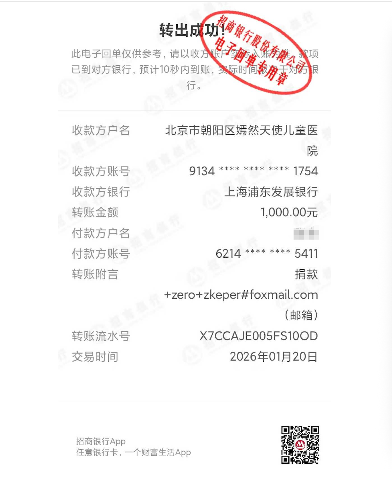

 [English](./README_US.md) | 中文
 

## 我的极客时间
极客时间课程在线文档，不仅仅是下载器，还是在线文档，支持部署为在线服务

---

* 看 markdown文档，推荐: https://github.com/uaxe/geektime-docs 🌟🌟🌟
* 看 pdf文档，推荐:  https://github.com/uaxe/geektime-pdfs 🌟🌟🌟
* 看 音视频，推荐:  https://github.com/zkep/my-geektime 🌟🌟🌟🌟🌟

特点：
 * 支持极客时间VIP账号一次缓存数据，永久观看
 * 支持一键发布整个课程为在线文档
 * 支持一键下载整个课程音视频资源到本地目录


### [项目文档](https://zkep.github.io/my-geektime/) | [在线体验](http://8.141.6.243:8090)


### 安装

1. 下载项目

```shell
git clone https://github.com/zkep/my-geektime.git
```
2. 获取镜像 （任选其一）
- 拉取仓库镜像
```shell
# 拉取linux/amd64架构的镜像
docker pull --platform=linux/amd64  zkep/mygeektime:latest

# 拉取linux/arm64架构的镜像
# docker pull --platform=linux/arm64  zkep/mygeektime:latest
```
- 本地构建镜像
```shell
docker build --platform linux/amd64  -t zkep/mygeektime:latest .
```

3. 启动服务
```shell
cd my-geektime/docker

docker-compose -f docker-compose.yml up -d
```

浏览器访问:  http://127.0.0.1:8090


#### 微信赞赏

如若有用，不吝赞赏👏

赞赏会帮大家定期捐给 北京嫣然天使儿童医院，用于兔唇儿童公益治疗，感谢大家的赞赏, [赞赏公示](https://github.com/zkep/my-geektime/issues/98)

赞赏并留言 <b>邮箱账号</b>，回赠<b> [数据库](https://zkep.github.io/my-geektime/guide/data_default/) </b>

<picture>
  
</picture>
<br/>
<picture>
  
</picture>


