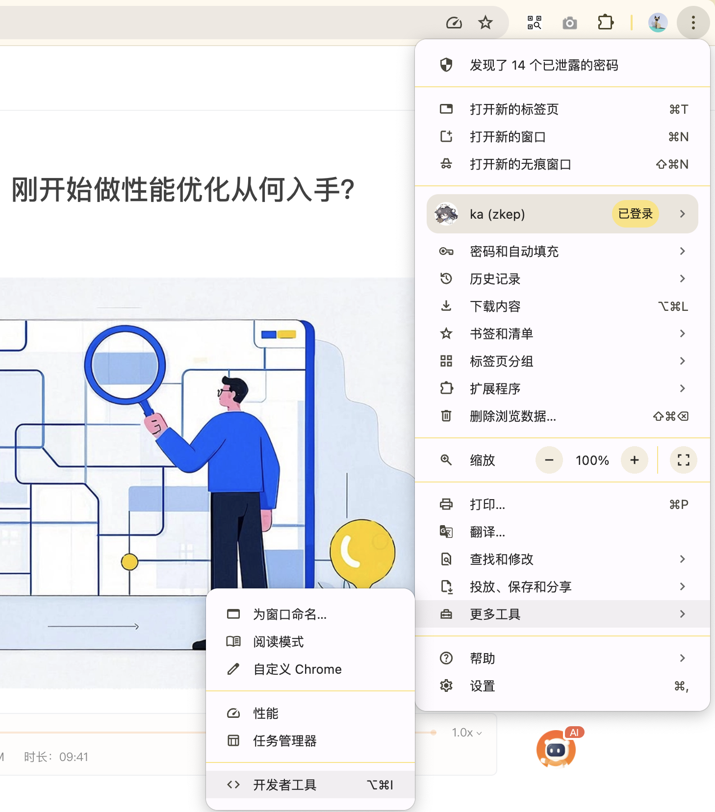
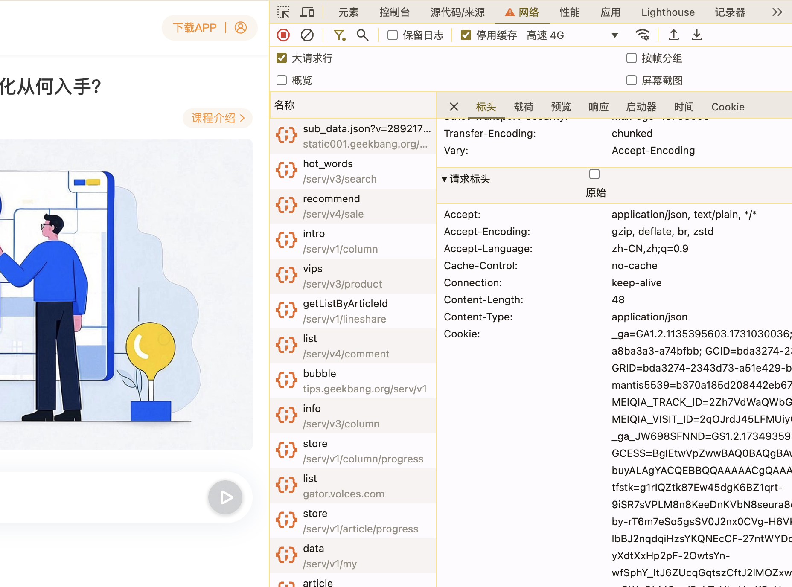
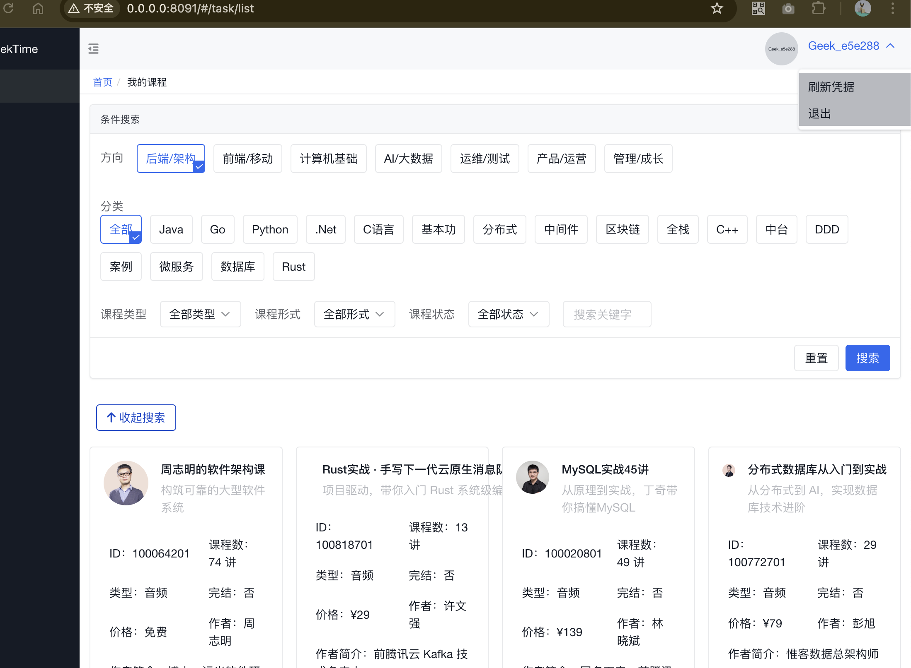
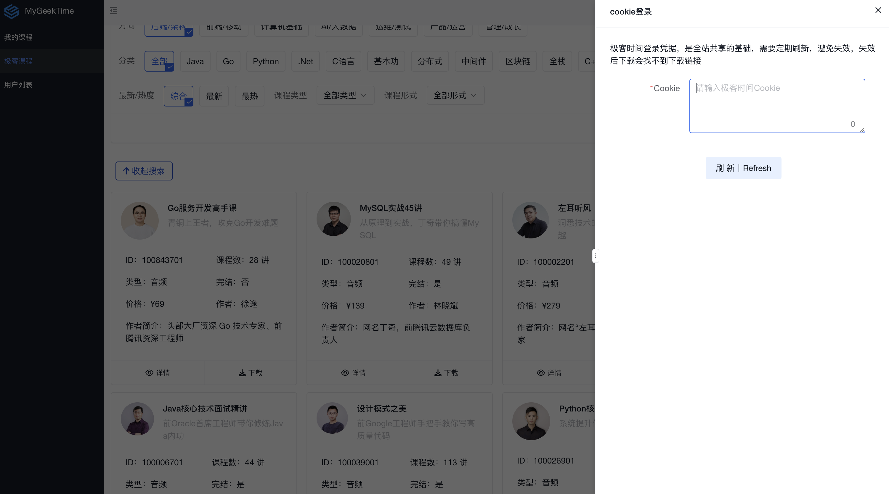
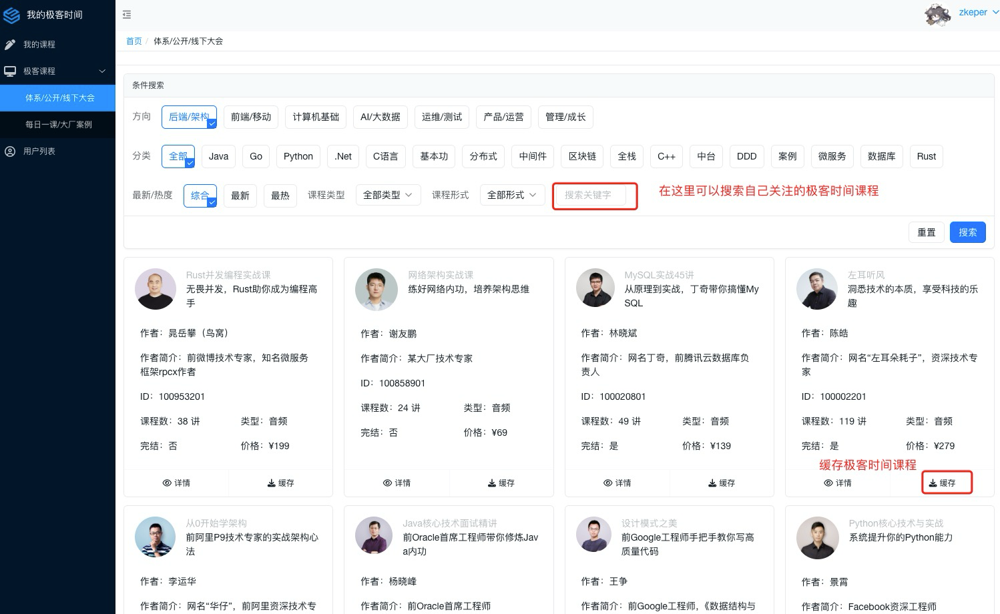
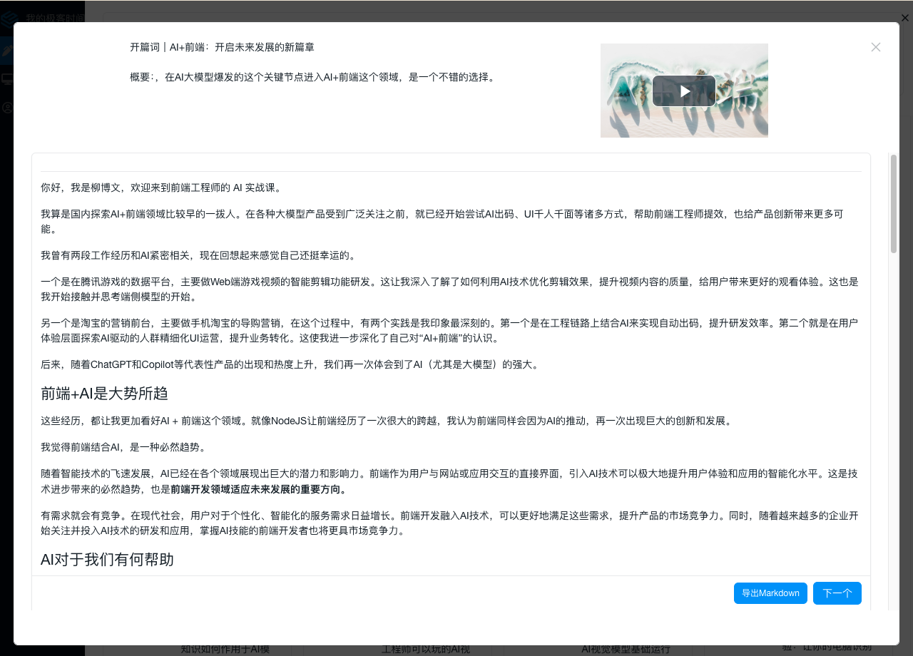

# 极客时间账号下载资源

**如果你已经有VIP或SVIP账号了，就可以直接使用自己的账号缓存资源**


## 获取极客时间cookie
目前仅支持用户手动获取,登录极客时间web端，打开开发者工具，查看network（网络）,在请求标头中拷贝**极客时间完整的cookie**






## 管理员刷新凭证
在我的极客时间右上角，点击用户头像，弹出【刷新凭据】，将上一步得到的极客时间cookie粘贴保存即可





## 管理员缓存课程
如果不进行上述的操作，在下载极客时间课程时候，会提示 【极客时间cookie不存在，请刷新cookie】





## 全站缓存
如果这种web方式不能满足你的缓存需求，可以考虑命令行方式

目前仅支持了： 

 * 体系课

 * 公开课

 * 线下大会

后续会支持更多，敬请期待

*注意⚠️*  默认是会进行音视频下载，全站缓存需要考虑下磁盘是否足够，保守估计2T

如果磁盘不足，可以暂时将该参数设置为false， 不会下载资源，但是不影响在线播放

```yaml
site:                      # 站点配置
  download: true           # 是否下载音视频，默认是
```

### docker 安装启动方式，执行命令
```shell
# 进入mygeektime命令行
# docker 直接运行容器名称为 mygeektime
# docker compose 运行容器名为  mygeektime-server-1
docker exec -it mygeektime  bash 
# 容器里执行如下命令
mygeektime cli data --config=config.yml
```