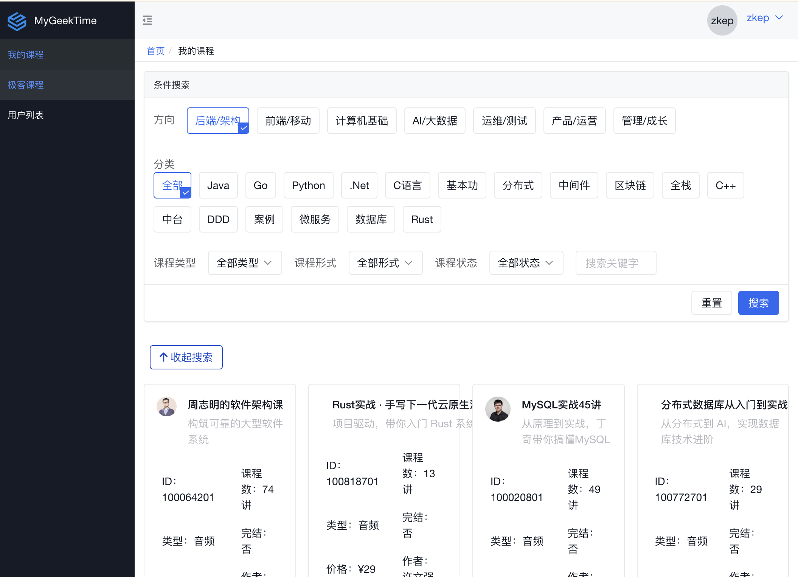
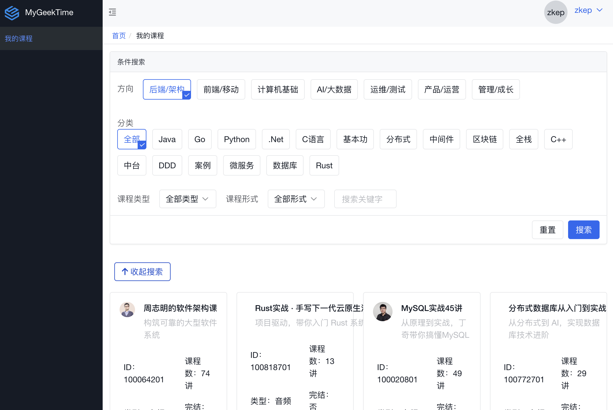
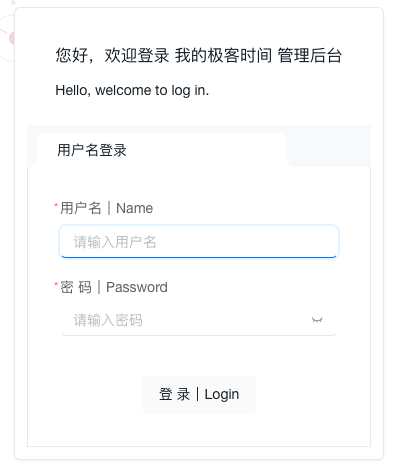

# 注册账号

默认**用户名密码**注册，第一个注册的用户默认是**管理员权限**

接下来注册的用户是**普通用户权限**

### 管理员权限：

  * 我的课程列表，缓存极客时间的课程
  * 极客时间课程，挑选课程进行缓存
  * 用户管理，开放给其他用户登录系统



### 普通用户权限：

 * 我的课程列表



### 邮箱注册 
*默认为用户名密码登录，如果需要邮箱注册登录，需要配置该信息*

修改配置文件中,邮箱配置，将注册方式site.register.type设置为 **email**

邮箱注册会给用户发送邮箱验证码，需要配置邮箱服务器

[QQ邮箱获取授权码](https://service.mail.qq.com/detail/0/75)

QQ邮箱为例，配置项 password 填写对应的授权码

```yaml
email:
  host: smtp.qq.com
  port: 587
  from: xxxxx@qq,com
  user: xxxxx@qq,com
  password: xxxxx

site:
  register:
    type: email # email | name | none
  email: # 注册时邮箱验证码内容设置
    subject: "我的极客时间邮箱验证码"
    body: "验证码： <b>%s</b> <br/><br/> <b>👏 扫下方微信二维码，欢迎加入技术交流群</b>"
    attach: wechat.jpg # 附件，空表示不添加附件📎
```


### 访客模式
填写guest访客账户名密码，即可开启访客模式，根据注册方式，配置登录的方式

guest访客账户名密码需要真实存在于系统中，也就是可以注册一个非管理账号填写guest配置信息

```yaml
site:
  login:
    type: name # email | name
    guest:
      name: 
      password: 
```
### 关闭注册
修改配置文件中，site.register.type 为 **none** 既可关闭注册页面
```yaml
site:
  download: true
  register:
    type: none # email | name | none
```
